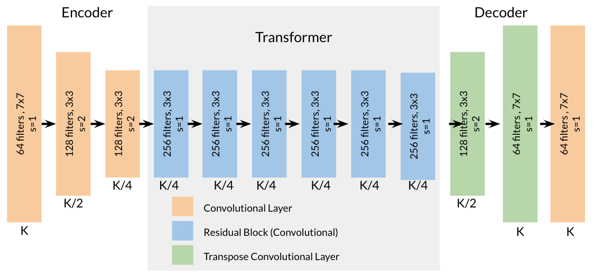
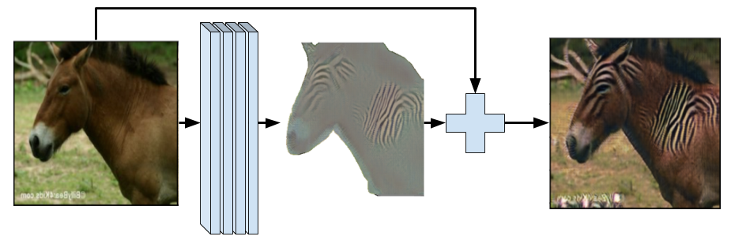
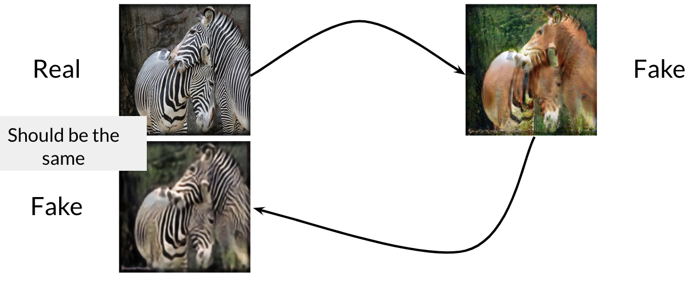

# Cycle-GAN-Horse-to-zebra-and-viceversa

In this notebook, we will write a generative model based on the paper Unpaired Image-to-Image Translation using Cycle-Consistent Adversarial Networks by Zhu et al. 2017, commonly referred to as CycleGAN.

## Generator
The code for a CycleGAN generator is much like Pix2Pix's U-Net with the addition of the residual block between the encoding (contracting) and decoding (expanding) blocks.

*Diagram of a CycleGAN generator: composed of encoding blocks, residual blocks, and then decoding blocks.*

#### Residual Block
Perhaps the most notable architectural difference between the U-Net and the architecture we're using for CycleGAN are the residual blocks. In CycleGAN, after the expanding blocks, there are convolutional layers where the output is ultimately added to the original input so that the network can change as little as possible on the image. You can think of this transformation as a kind of skip connection, where instead of being concatenated as new channels before the convolution which combines them, it's added directly to the output of the convolution.

## Generator Loss
While there are some changes to the CycleGAN architecture from Pix2Pix, the most important distinguishing feature of CycleGAN is its generator loss. we will be implementing that here!

#### Adversarial Loss
The first component of the generator's loss we're going to implement is its adversarial loss. The important thing to note is that the criterion is based on least squares loss, rather than binary cross entropy loss or W-loss.

#### Identity Loss
You'll want to measure the change in an image when you pass the generator an example from the target domain instead of the input domain it's expecting. The output should be the same as the input since it is already of the target domain class. For example, if you put a horse through a zebra -> horse generator, you'd expect the output to be the same horse because nothing needed to be transformed. It's already a horse! You don't want your generator to be transforming it into any other thing, so you want to encourage this behavior. In encouraging this identity mapping, the authors of CycleGAN found that for some tasks, this helped properly preserve the colors of an image, even when the expected input (here, a zebra) was put in. This was particularly useful for the photos <-> paintings mapping and, while an optional aesthetic component, you might find it useful for your applications down the line.

#### Cycle Consistency Loss
This is used to ensure that when we put an image through one generator, that if it is then transformed back into the input class using the opposite generator, the image is the same as the original input image.

Since we've already generated a fake image for the adversarial part, we can pass that fake image back to produce a full cycle—this loss will encourage the cycle to preserve as much information as possible.
